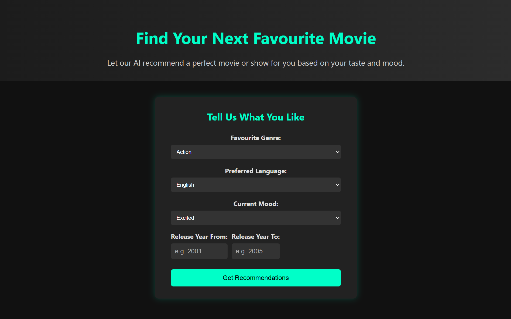

# 🎬 Movie Recommender

This project is a practice app for learning how to **connect to an external API** and **fetch data** from it.  
It uses **HTML, CSS, JavaScript (frontend)** and a small **Express.js backend** that connects the frontend with the [TMDB API](https://www.themoviedb.org/).

The app allows users to select their preferences (genre, language, mood, release year range) and then fetches recommended movies from TMDB.

---

## Screenshot



---

## Features

- Choose a **genre**, **language**, **mood**, and release **year range**.
- Fetch movies from TMDB API based on these filters.
- Display results as styled movie cards (title, release date, language, overview, and poster image).
- Responsive design using plain CSS.
- Simple backend with **Node.js + Express** to handle API requests securely.

---

## Tech Stack

- **Frontend:** HTML, CSS, JavaScript
- **Backend:** Node.js, Express.js
- **API:** TMDB (The Movie Database)

---

## Project Structure

```
movie-app/
│
├── public/
│ ├── index.html # Main HTML file
│ ├── style.css # Styles
│ └── script.js # Frontend logic
│
├── server.js # Express backend
├── package.json # Dependencies & scripts
├── .env # API key (not included in repo)
└── README.md
```

## Installation & Setup

1. **Clone the repository**

   ```bash
   git clone https://github.com/Irina-Kostina/movie-app.git
   cd movie-app

   ```

2. **Install dependencies**

   ```bash
   npm install

   ```

3. **Get TMDB API key**
   Sign up at TMDB
   Create a .env file in the root of your project and add:

   ```bash
   TMDB_API_KEY=your_api_key_here

   ```

4. **Start the server**

   ```bash
   npm start
   ```

5. **Open the app**
   Go to [http://localhost:3000](http://localhost:3000) in your browser.

## Learning Goals

This project was created as a practice exercise to:

- Learn how to connect frontend to a backend API
- Practice fetching data from external APIs (TMDB)
- Understand how to render dynamic content in the browser
- Use Express.js for a simple backend proxy

---

## Future Improvements

- Improve filtering logic to better match mood selections
- Add search by actor or director
- Deploy app to Vercel/Netlify + Render

---

## License

This project is for **educational purposes only**.
API usage is powered by [TMDB](https://www.themoviedb.org/).
